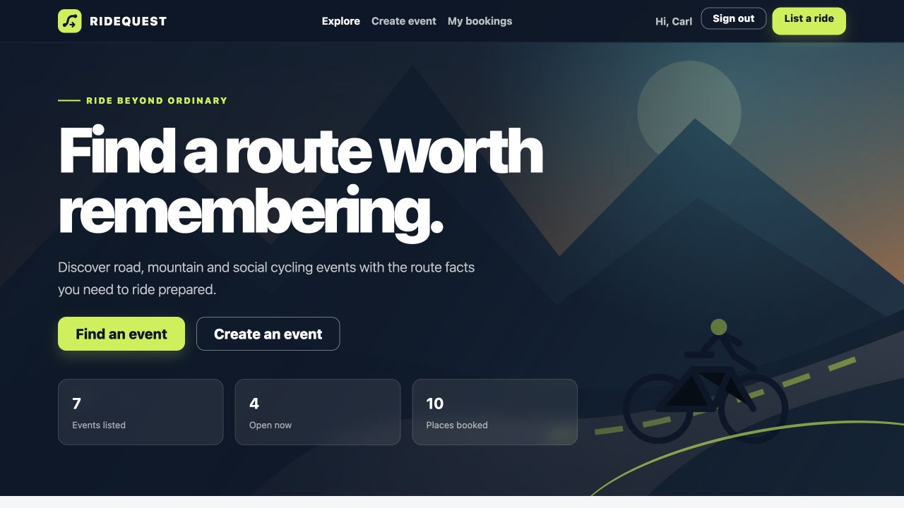
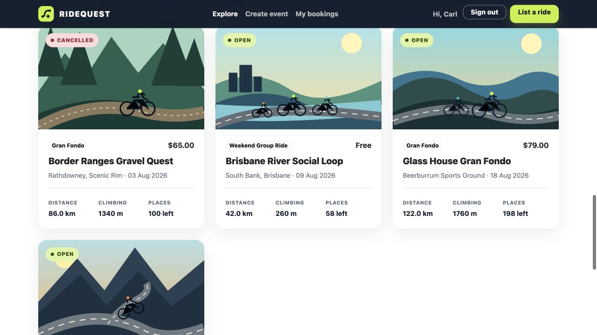
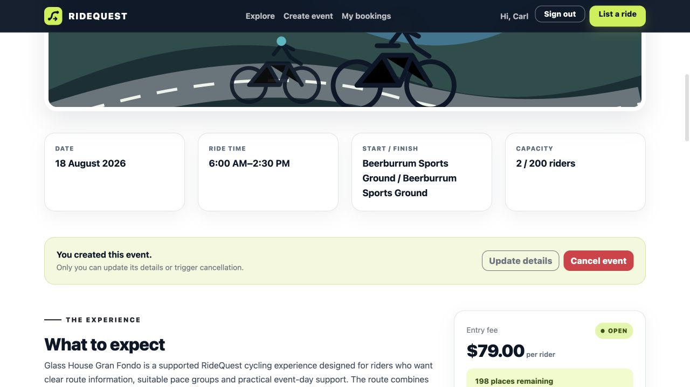

<p align="center">
  
</p>

<h1 align="center">RideQuest</h1>

<p align="center">
  A responsive Flask cycling event management system for discovering, creating,
  booking and discussing road cycling, hill-climb and weekend group-ride events.
</p>

## Core Features

- Search and filter cycling events by keyword, category, difficulty and status.
- View detailed event, route, elevation, supply-point and equipment information.
- Register, sign in and sign out using securely hashed passwords.
- Create cycling events and update or cancel events owned by the current user.
- Book available places with participation-group, bicycle and safety confirmation.
- Automatically present events as Open, Sold Out or Inactive, with creator-triggered cancellation.
- Post event comments and review the signed-in user's real booking history.
- Display responsive Bootstrap interfaces and friendly 400, 403, 404, 413 and 500 error pages.

## Core Features and Interface

<p align="center">
  
</p>

<p align="center">
  <em>RideQuest home page — search, category filters, event status and responsive event discovery.</em>
</p>

<p align="center">
  
</p>

<p align="center">
  <em>Event details — route information, supply points, comments, availability and booking controls.</em>
</p>

## Technology Stack

- Python 3 and Flask
- Flask-SQLAlchemy and SQLite
- Flask-WTF and WTForms
- Flask-Login
- Bootstrap-Flask and Bootstrap 5
- Jinja templates
- HTML5, CSS3 and local SVG assets
- Werkzeug password hashing and filename sanitisation
- Python `unittest` with the Flask test client

## Project Structure

```text
a2_group02/
├── main.py
├── seed_data.py
├── requirements.txt
├── README.md
├── docs/
│   ├── banner.png
│   ├── home.png
│   └── event_details.png
├── ridequest/
│   ├── __init__.py
│   ├── auth.py
│   ├── errors.py
│   ├── events.py
│   ├── forms.py
│   ├── models.py
│   ├── views.py
│   ├── sitedata.sqlite
│   ├── static/
│   │   ├── img/
│   │   ├── style/
│   │   └── uploads/
│   └── templates/
│       └── errors/
└── tests/
    └── test_app.py
```

## Run the Application

From the `a2_group02` folder, install the required packages and start Flask:

```bash
python3 -m pip install -r requirements.txt
python3 main.py
```

Open [http://127.0.0.1:5000](http://127.0.0.1:5000) in a browser.

The submitted `ridequest/sitedata.sqlite` database already contains synthetic
users, events, bookings and comments. The database is ready to use and does not
need to be recreated before assessment.

## Demonstration Accounts

| User | Email | Password |
| --- | --- | --- |
| Carl Pan | `carl@example.com` | `RideQuest123!` |
| Maya Lee | `maya@example.com` | `RideQuest123!` |
| Sam Chen | `sam@example.com` | `RideQuest123!` |

All demonstration accounts use the password `RideQuest123!`.

Carl owns the **Glass House Gran Fondo** and can demonstrate updating or
cancelling that event. Other signed-in users receive a friendly **403 Forbidden**
response if they attempt to edit or cancel Carl's event.

## Optional Database Reset

To delete and rebuild the synthetic demonstration database:

```bash
python3 seed_data.py
```

This command recreates `ridequest/sitedata.sqlite` with demonstration users,
events, bookings, comments and all four event states.

## Tests

Run the automated test suite from the project folder:

```bash
python3 -m unittest discover -s tests -v
```

The tests cover registration, authentication protection, search, event
creation and updates, creator-only cancellation, bookings and capacity,
comments, booking history, and friendly 404 and 500 handling.

## Notes for Assessors

- Run `python3 main.py` from the outer project folder so Flask can locate the package and database correctly.
- The working SQLite database is included inside the `ridequest` package and contains synthetic data only.
- No virtual environment is included in the submission.
- Event status is application-managed: date and remaining capacity determine Open, Inactive and Sold Out, while only the event creator can trigger Cancelled.
- Uploaded event images are restricted to supported image types and a maximum request size of 5 MB.
- The source includes explanatory comments where they clarify application workflow without duplicating self-evident code.
